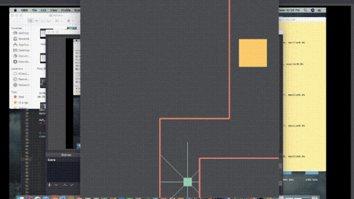

#Deep Q Network Maze Game

This project is designed to have a player agent teach itself to reach a goal using the deep reinforcment learning algorithm "Deep Q Networks" (DQN).

#Description



This project was my first attempt at building a DQN in Python using the Tensorflow Keras API, Numpy, and PyGame. *These three dependencies must be installed before running either file.* The goal of the project was for a player agent (in blue) to learn to navigate a playspace without hitting any walls (in red). The player's final goal is to reach the goal cube at the end of the level (orange). The DQN works off of a rather straightforward reward system. The closer the player agent moves toward the goal the higher reward it attains, the further away the larger penalty. Passing certain checkpoints results in a much larger reward than avialable from moving towards the goal. This is a rather high level explination of how the model is trained, and a more detailed summary is included in the "How Does it Work?" section.


The Deep Q Network is based off of Jon Krohn's "Deep Q Learning Networks" video, linked here: https://youtu.be/OYhFoMySoVs

The game and how it interacts with the DQN model is structured according to what I could learn from OpenAI's Gym documentation (https://gym.openai.com/docs/). I decided to make my own version of how I assumed the project worked from the docs in order to personally learn more about the thought process (and literal process) behind designing a reinfornment learning environment from scratch.

Analytics from succesful runs are provided under the "Results" directory.


#Basic Usage

Creating a game environment is as simple as defining a new Environment object with a given player velocity, a screen size set (heavily suggested you use 500 by 500 size), and stage number (zero or one). You will also need to define your reinforcment learning model of choice, in this example, labeled "agent."

```python
import Game
SCREEN_SIZE = (500, 500)
game = Game.Environment(vel = 10, screen_size = SCREEN_SIZE, stage_num = 1)
agent = DQN(state_size, action_size)
```

The loop the agent goes through is as follows:

1. Render current frame to screen based on current game logic.
```python
game.show()
```


2. Have model choose either a random action or a learned action based on agent's epsilon value (more information in "How Does it Work?" section)
```python
action = agent.act(state)
```


3. Feed action to the game, which relays back the next state of the game given the input action. This also moves the game logic to it's next frame (yet to be rendered). The variables returned represent the following:

```python
next_state, reward, done, has_won = game.step(action)
```

next_state: given an input action, what does the game state look like on the next frame? This includes player's x and y positions, and how far each ray representing player's vision extends until reaching an obstacle. It is represented with each variable one after another in list format.

reward: the float that represents the value of the reward from moving closer or further away from goal (or passing a reward gate)

done: boolean, returns true if that next step ends the game for any reason (timeout, win or loss)

has_won returns true if that next step results in a win


4. Feed next game state and current gamestate into agent memory deque (or however you have your agent set up). Make sure our current step is now the next step (as the game has moved forward at this point, it just hasn't been rendered yet)

```python
agent.remember(state, action, reward, next_state, done) # replace with however your agent works
state = next_state
```


5. once the array reached a predefined size, send a random sample of that memory through DQN. Or don't. But problably have your agent do the "learning" at this point. repeat from step 1 until the player has hit an obstacle, won the game, or ran out of time.

```python
if len(agent.memory) > batch_size:
	agent.replay(batch_size)
```
If you would like to replace the DQN with your own fancy nueral network/reinforncment learning hybrid child of your own, the Deep-Q Environment class can just be called into a seperate project without much difficulty. Just import the class, follow the five steps (while maybe referring to "test.py" from lines 116 down), and get rolling. In retrospect, naming the python file "Game" was problably... not terribly thoughtful. 20/20 Hindsight and all, right? Then again, writing this document seven months later it kind of stands as a relic to my own naivete at the time of building the project. I kind of love it to be honest. The name is staying. That's final.

#How Does it Work??

Ok, lets get technical.

